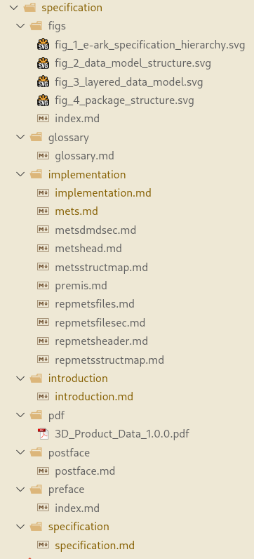

# Record of steps taken to move this CITS to the new publication platform

## Added this `PUBLICATION.md` file

This is simply a record of the steps taken to add this CITS to the new publication platform. The steps are recorded
here so that they can be repeated for other CITS.

```bash
git add PUBLICATION.md
```

## Added `spec-publisher` project as a git submodule

The spec-publisher project is required to:

- generate tables of requirements from the CITS METS profiles; and
- generate preface material, acknowledgements, and appendices.

The spec-publisher project is a git submodule of the CITS project. This means that the spec-publisher project is a
separate git repository that is included in the CITS project as a subdirectory. The spec-publisher project is not
included in the CITS project's git history. Instead, the CITS project includes a reference to the spec-publisher
project's git repository and commit.

```bash
git submodule add git@github.com:DILCISBoard/spec-publisher.git
git commit -m "Add spec-publisher as a submodule"
```

## Modularise the specificataion, breaking at tables

Next we break down the Mardown files so that there is an end of a Markdown file before every table. Follwing this the
`specification` folder looks like this:



## Create a `specification.yaml` YAML file that describes the final document structure

The `specification.yaml` sequences all of the separate Markdown files, generated tables of requirements and other
material into a coherent document. The document is broken into three sections:

1. preface
2. body
3. appendices

The distinction controls the pagination, insertion of contents and a few other things.

### Preface

This imports the common introduction to all E-ARK specifications, from the `spec-publisher` project sub-module.

```yaml
preface:
  - name: introduction                            # A name for the section, really for readability
    type: file                                    # The type of content, controls the handling in spec-publisher
    source: spec-publisher/res/md/common-intro.md # The relative path to the common-intro.md file
```

### Body

This sequences the main body of the document in similar fashion to the preface. It also uses the `type: requirements`
to generate tables of requirements from the METS profiles.

```yaml
body:
...
  - name: implementation
    type: file
    source: specification/implementation/implementation.md

  - name: requirements.METS.root
    type: requirements
    heading: "Table 2: Root METS root element (element METS root)"
    requirements:
      - 3DPM12
      - 3DPM13
      - 3DPM14
      - 3DPM15
```

The second block (`name: requirements.METS.root`) above shows how to describe a table of requirements. There is no `source:` key as the content is generated by the spec-publisher. The `heading:` key is used to provide a heading for the table. The `requirements:` key is a list of requirement identifiers that are used to generate the table.

### Appendices

All of the appenices are automatically generated from the METS profile by the spec-publisher. It is possible to include Markdown files in the appendices as well.

```yaml

appendices:
  - name: mets.examples                                 # Generates a list of examples
    heading: "CITS3D Information Package METS Examples" # The heading for the Appnedix
    label: "A"                                          # The label for the Appendix
    type: mets                                          # The type of content, controls the handling in spec-publisher
    section: Appendix                                   # The section of the METS file to use for the section

  - name: mets.schema                                   # Generates a list of external schema
    heading: "External Schema"
    label: "B"
    type: mets
    section: external_schema

  - name: mets.vocabs                                   # Generates a list of external vocabularies
    heading: "External Vocabularies"
    label: "C"
    type: mets
    section: vocabulary

  - name: mets.metadata.requirments                     # Generates a list of all profile requirements
    heading: "E-ARK CITS3D Metadata Requirements"
    label: "E"
    type: mets
    section: requirements
```

These sections simply use the appropriate METS file elements, identified by the `section:` value, to generate the content.
